# Java | Homework 01

## Tasks

* [Task_1](./src/Task_1/) --> [Task_1.java](./src/Task_1/Task_1.java)
* [Task_2](./src/Task_2/) --> [Task_2.java](./src/Task_2/Task_2.java)
* [Task_3](./src/Task_3/) --> [Task_3.java](./src/Task_3/Task_3.java)
* [Task_4](./src/Task_4/) --> [Task_4.java](./src/Task_4/Task_4.java)
* [Task_5](./src/Task_5/) --> [Task_5.java](./src/Task_5/Task_5.java)
* [Task_6](./src/Task_6/) --> [Task_6.java](./src/Task_6/Task_6.java)
* [Task_7](./src/Task_7/) --> [Task_7.java](./src/Task_7/Task_7.java)
* [Task_8](./src/Task_8/) --> [Task_8.java](./src/Task_8/Task_8.java)
* [Task_9](./src/Task_9/) --> [Task_9.java](./src/Task_9/Task_9.java)
* [Task_10](./src/Task_10/) --> [Task_10.java](./src/Task_10/Task_10.java)
* [Task_11](./src/Task_11/) --> [Task_11.java](./src/Task_11/Task_11.java)
* [Task_12](./src/Task_12/) --> [Task_12.java](./src/Task_12/Task_12.java)

## Screenshots

### Task_1

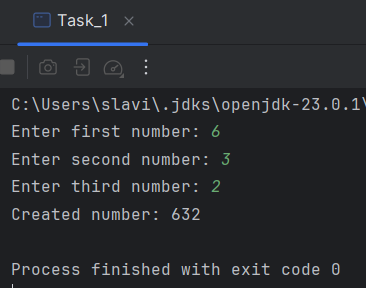

### Task_2

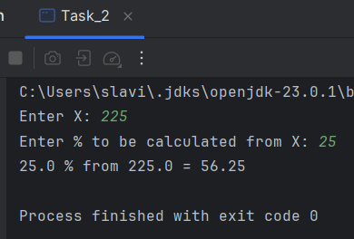

### Task_3

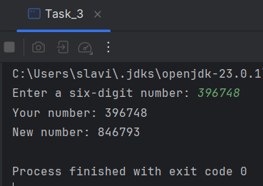

### Task_4

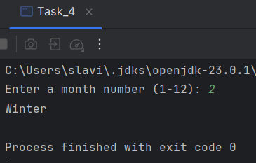
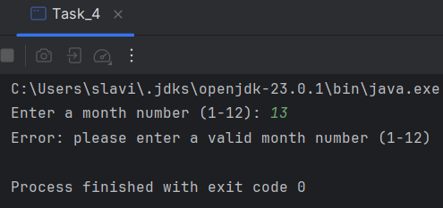

### Task_5

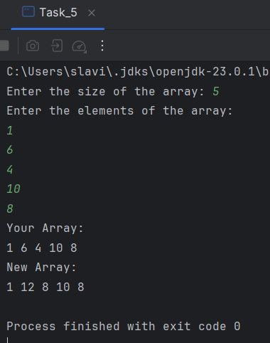

### Task_6

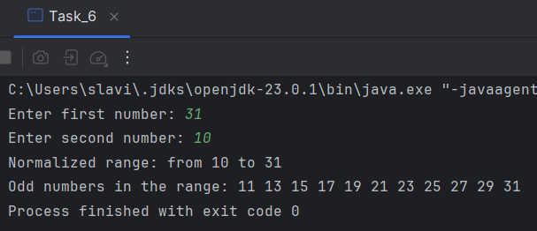

### Task_7

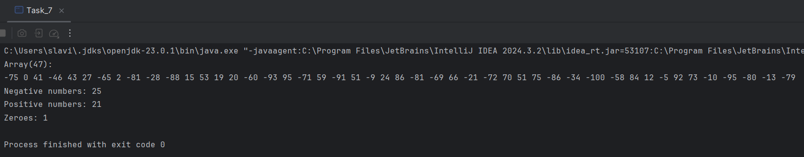

### Task_8

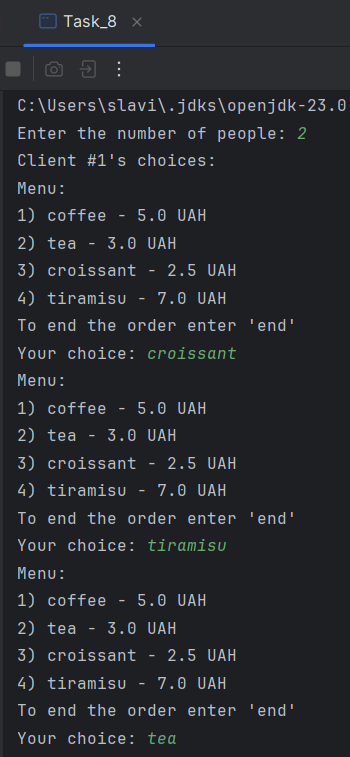
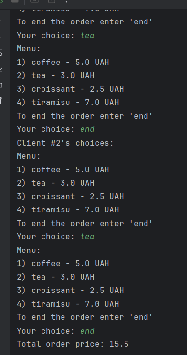

### Task_9

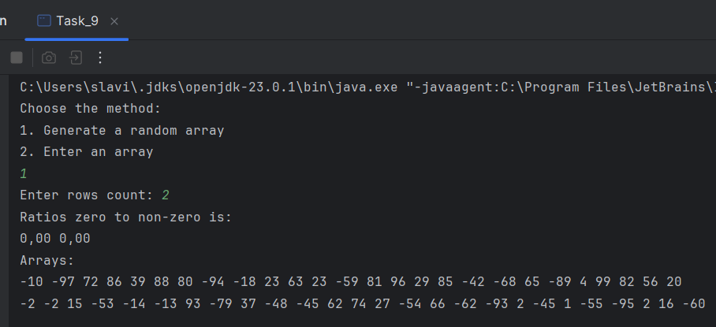

### Task_10

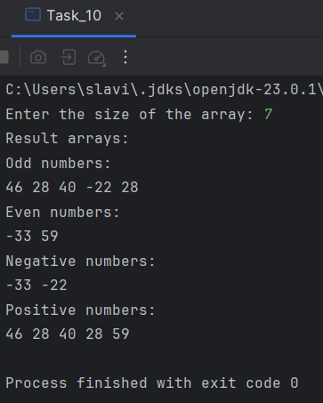

### Task_11

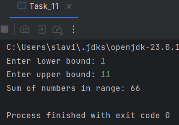

### Task_12

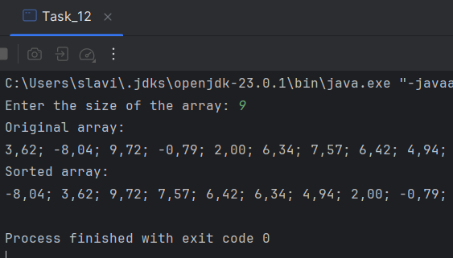
