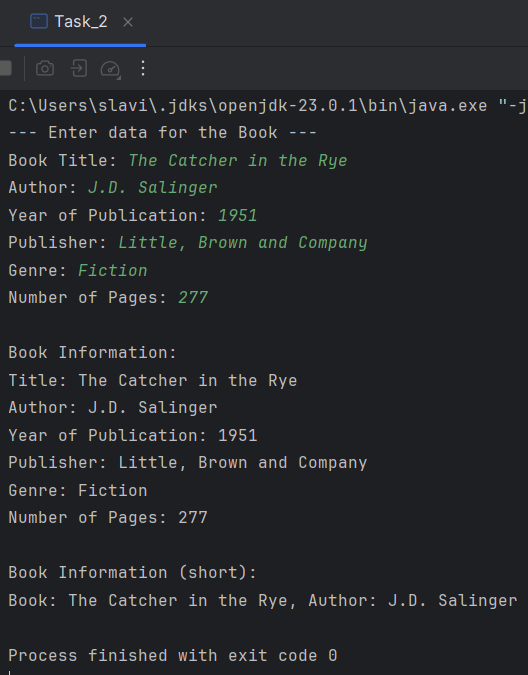

# Java | Homework 02

## Tasks

* [Task_1](./src/Task_1/)
    - [Country.java](./src/Task_1/Country.java)
    - [Task_1.java](./src/Task_1/Task_1.java)
* [Task_2](./src/Task_2/)
    - [Book.java](./src/Task_2/Book.java)
    - [Task_2.java](./src/Task_2/Task_2.java)
* [Task_3](./src/Task_3/)
    - [Car.java](./src/Task_3/Car.java)
    - [Task_3.java](./src/Task_3/Task_3.java)

## Screenshots

### Task_1

### Task_2

### Task_3

