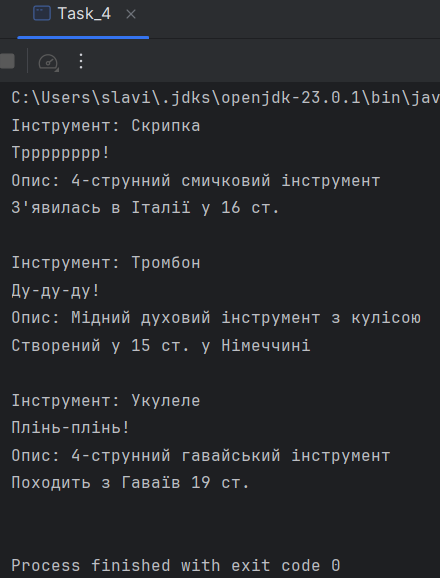

# Java | Homework 03

## Tasks

* [Task_1](./src/Task_1/)
    - [Article.java](./src/Task_1/Article.java)
    - [Frequency.java](./src/Task_1/Frequency.java)
    - [Human.java](./src/Task_1/Human.java)
    - [Magazine.java](./src/Task_1/Magazine.java)
    - [Task_1.java](./src/Task_1/Task_1.java)
* [Task_2](./src/Task_2/)
    - [IsoscelesTriangle.java](./src/Task_2/IsoscelesTriangle.java)
    - [Task_2.java](./src/Task_2/Task_2.java)
    - [Triangle.java](./src/Task_2/Triangle.java)
* [Task_3](./src/Task_3/)
    - [Circle.java](./src/Task_3/Circle.java)
    - [Figure.java](./src/Task_3/Figure.java)
    - [Rectangle.java](./src/Task_3/Rectangle.java)
    - [RightTriangle.java](./src/Task_3/RightTriangle.java)
    - [Task_3.java](./src/Task_3/Task_3.java)
    - [Trapezoid.java](./src/Task_3/Trapezoid.java)
* [Task_4](./src/Task_4/)
    - [IInfo.java](./src/Task_4/IInfo.java)
    - [MusicalInstrument.java](./src/Task_4/MusicalInstrument.java)
    - [Task_4.java](./src/Task_4/Task_4.java)
    - [Trombone.java](./src/Task_4/Trombone.java)
    - [Ukulele.java](./src/Task_4/Ukulele.java)
    - [Violin.java](./src/Task_4/Violin.java)

## Screenshots

### Task_1

### Task_2

### Task_3

### Task_4

