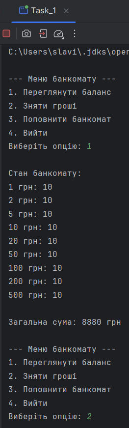
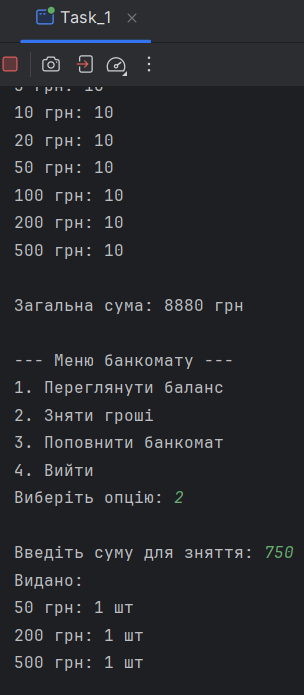
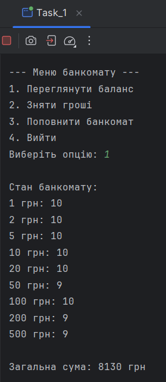
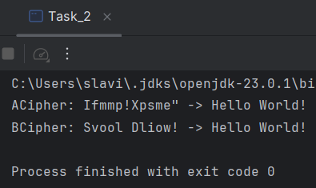
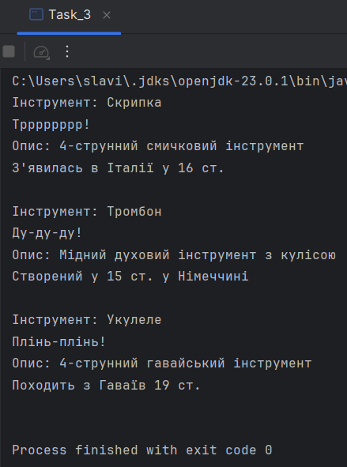
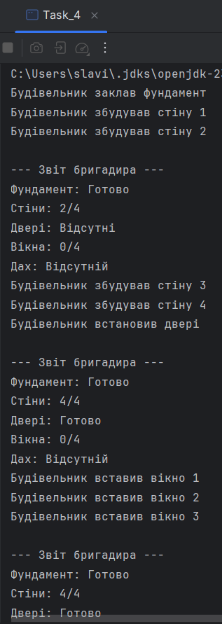
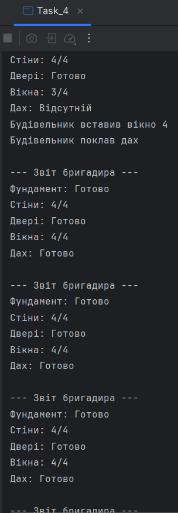
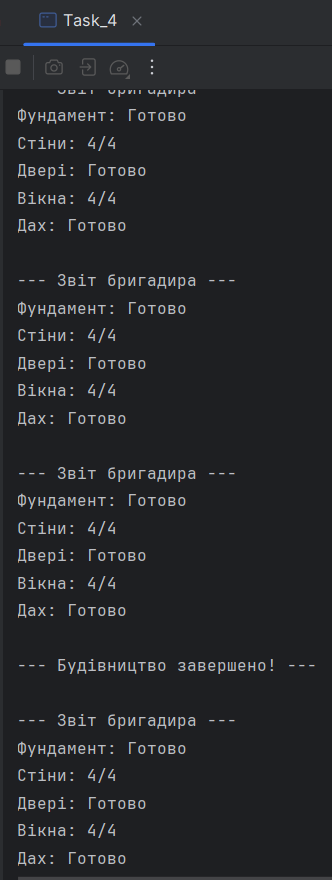

# Java | Homework 4-1

## Tasks

* [Task_1](./src/Task_1/)
    - [ATM.java](./src/Task_1/ATM.java)
    - [ATMException.java](./src/Task_1/ATMException.java)
    - [Bank.java](./src/Task_1/Bank.java)
    - [Task_1.java](./src/Task_1/Task_1.java)
* [Task_2](./src/Task_2/)
    - [ACipher.java](./src/Task_2/ACipher.java)
    - [BCipher.java](./src/Task_2/BCipher.java)
    - [ICipher.java](./src/Task_2/ICipher.java)
    - [Task_2.java](./src/Task_2/Task_2.java)
* [Task_3](./src/Task_3/)
    - [IInfo.java](./src/Task_3/IInfo.java)
    - [MusicalInstrument.java](./src/Task_3/MusicalInstrument.java)
    - [Task_3.java](./src/Task_3/Task_3.java)
    - [Trombone.java](./src/Task_3/Trombone.java)
    - [Ukulele.java](./src/Task_3/Ukulele.java)
    - [Violin.java](./src/Task_3/Violin.java)
* [Task_4](./src/Task_4/)
    - [Basement.java](./src/Task_4/Basement.java)
    - [Door.java](./src/Task_4/Door.java)
    - [House.java](./src/Task_4/House.java)
    - [IPart.java](./src/Task_4/IPart.java)
    - [IWorker.java](./src/Task_4/IWorker.java)
    - [Roof.java](./src/Task_4/Roof.java)
    - [Task_4.java](./src/Task_4/Task_4.java)
    - [Team.java](./src/Task_4/Team.java)
    - [TeamLeader.java](./src/Task_4/TeamLeader.java)
    - [Walls.java](./src/Task_4/Walls.java)
    - [Window.java](./src/Task_4/Window.java)
    - [Worker.java](./src/Task_4/Worker.java)

## Screenshots

### Task_1

### Task_2

### Task_3

### Task_4

