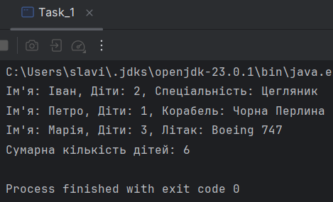
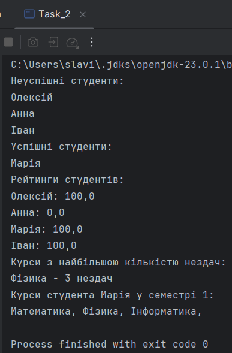
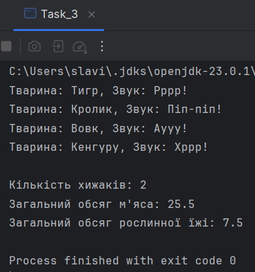

# Java | Homework 04

## Tasks

* [Task_1](./src/Task_1/)
    - [Builder.java](./src/Task_1/Builder.java)
    - [Human.java](./src/Task_1/Human.java)
    - [Pilot.java](./src/Task_1/Pilot.java)
    - [Sailor.java](./src/Task_1/Sailor.java)
    - [Task_1.java](./src/Task_1/Task_1.java)
* [Task_2](./src/Task_2/)
    - [Course.java](./src/Task_2/Course.java)
    - [Group.java](./src/Task_2/Group.java)
    - [Student.java](./src/Task_2/Student.java)
    - [Task_2.java](./src/Task_2/Task_2.java)
* [Task_3](./src/Task_3/)
    - [Animal.java](./src/Task_3/Animal.java)
    - [Kangaroo.java](./src/Task_3/Kangaroo.java)
    - [Rabbit.java](./src/Task_3/Rabbit.java)
    - [Task_3.java](./src/Task_3/Task_3.java)
    - [Tiger.java](./src/Task_3/Tiger.java)
    - [Wolf.java](./src/Task_3/Wolf.java)

## Screenshots

### Task_1

### Task_2

### Task_3

