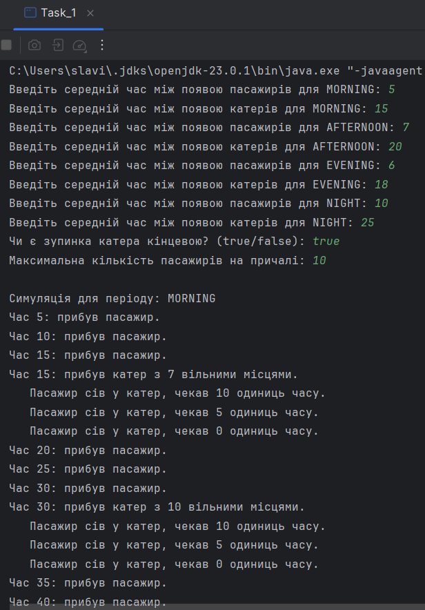
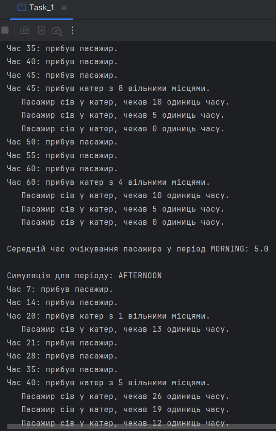
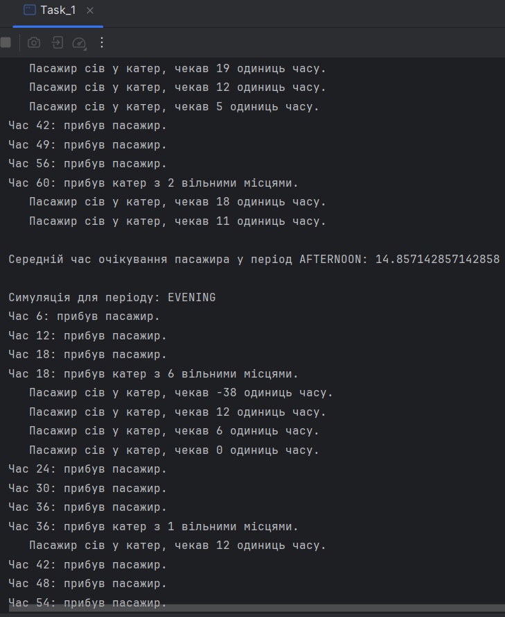
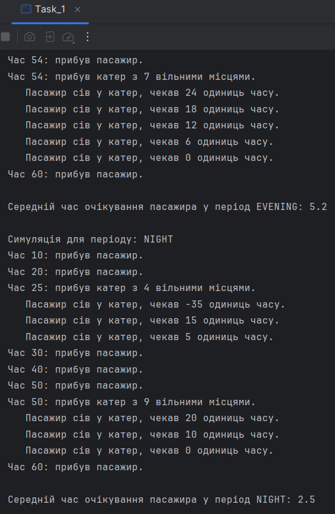
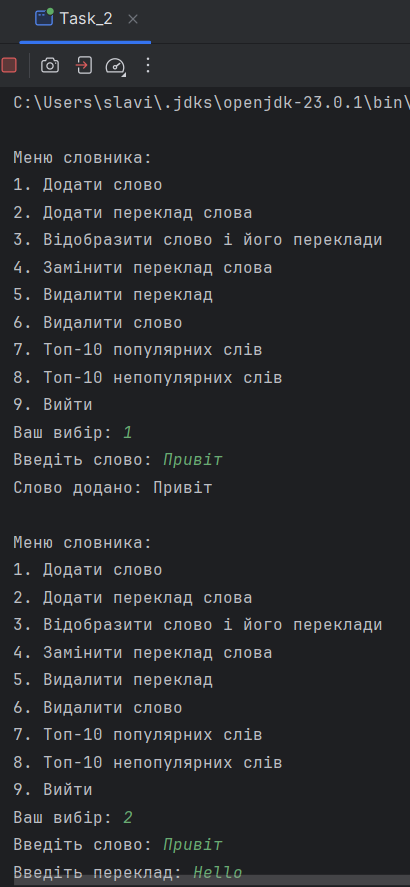
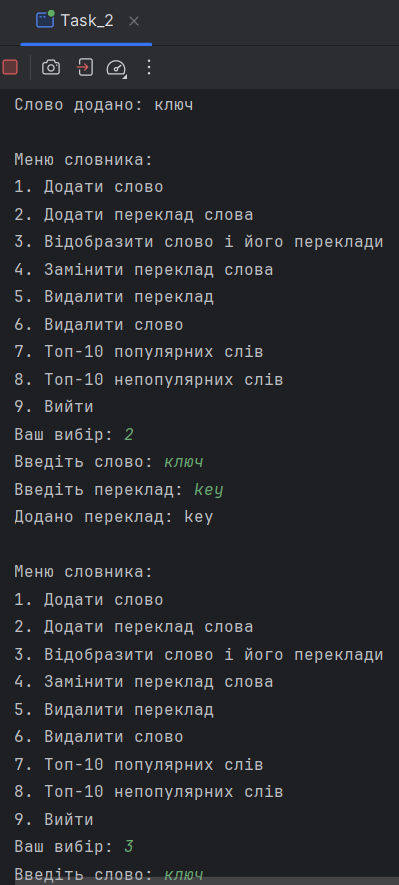
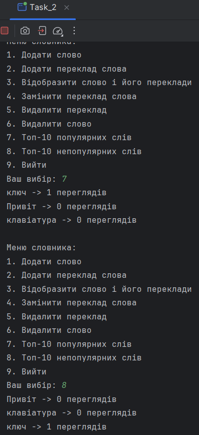
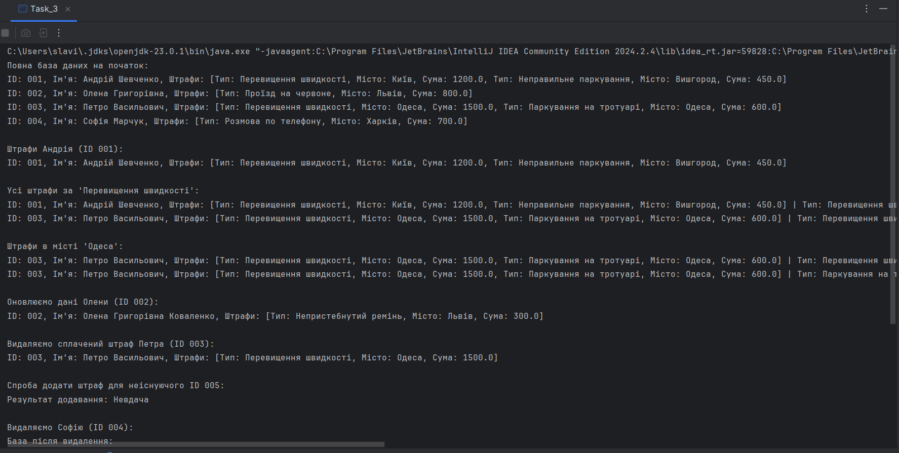
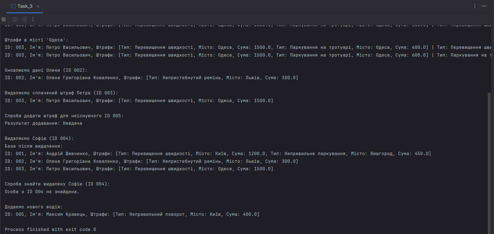

# Java | Homework 1

## Tasks

* [Task_1](./src/Task_1/)
    - [Boat.java](./src/Task_1/Boat.java)
    - [Dock.java](./src/Task_1/Dock.java)
    - [Passenger.java](./src/Task_1/Passenger.java)
    - [SimulationParameters.java](./src/Task_1/SimulationParameters.java)
    - [Task_1.java](./src/Task_1/Task_1.java)
    - [TimeOfDay.java](./src/Task_1/TimeOfDay.java)
* [Task_2](./src/Task_2/)
    - [Dictionary.java](./src/Task_2/Dictionary.java)
    - [Task_2.java](./src/Task_2/Task_2.java)
* [Task_3](./src/Task_3/)
    - [Fine.java](./src/Task_3/Fine.java)
    - [Person.java](./src/Task_3/Person.java)
    - [Task_3.java](./src/Task_3/Task_3.java)
    - [TaxDatabase.java](./src/Task_3/TaxDatabase.java)

## Screenshots

### Task_1

### Task_2

### Task_3

