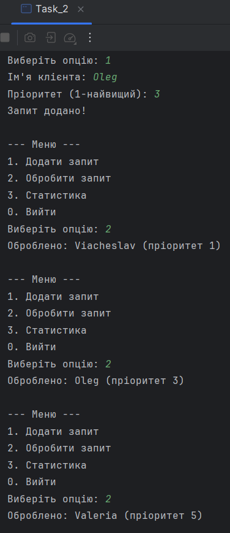

# Java | Homework 05

## Tasks

* [Task_1](./src/Task_1/)
    - [Task_1.java](./src/Task_1/Task_1.java)
    - [User.java](./src/Task_1/User.java)
    - [UserDatabase.java](./src/Task_1/UserDatabase.java)
* [Task_2](./src/Task_2/)
    - [ClientRequest.java](./src/Task_2/ClientRequest.java)
    - [RequestSystem.java](./src/Task_2/RequestSystem.java)
    - [Task_2.java](./src/Task_2/Task_2.java)

## Screenshots

### Task_1

### Task_2

