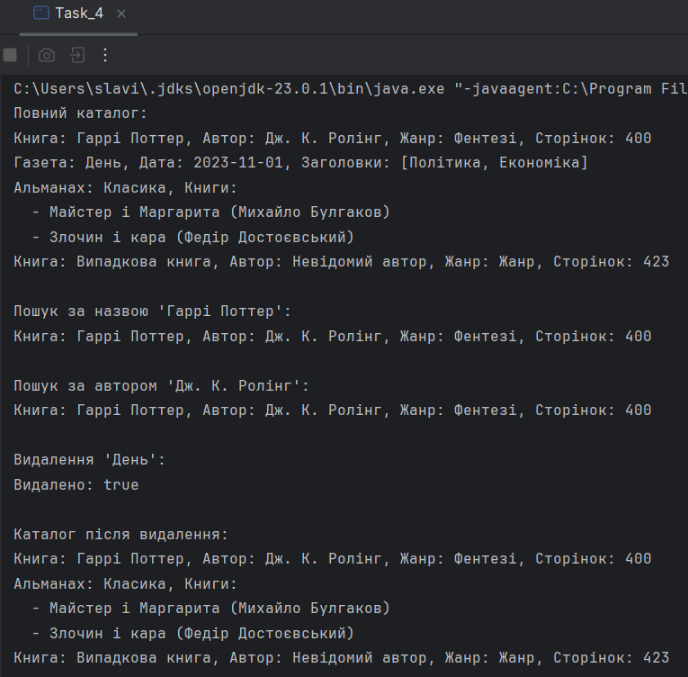

# Java | Homework 06

## Tasks

* [Task_1](./src/Task_1/)
    - [DateDifference.java](./src/Task_1/DateDifference.java)
    - [SundayCounter.java](./src/Task_1/SundayCounter.java)
    - [Task_1.java](./src/Task_1/Task_1.java)
* [Task_2](./src/Task_2/)
    - [FourNumberOperation.java](./src/Task_2/FourNumberOperation.java)
    - [Task_2.java](./src/Task_2/Task_2.java)
* [Task_3](./src/Task_3/)
    - [NumberCondition.java](./src/Task_3/NumberCondition.java)
    - [Task_3.java](./src/Task_3/Task_3.java)
* [Task_4](./src/Task_4/)
    - [AbstractLibraryItem.java](./src/Task_4/AbstractLibraryItem.java)
    - [Almanac.java](./src/Task_4/Almanac.java)
    - [Book.java](./src/Task_4/Book.java)
    - [LibraryCatalog.java](./src/Task_4/LibraryCatalog.java)
    - [LibraryItem.java](./src/Task_4/LibraryItem.java)
    - [Newspaper.java](./src/Task_4/Newspaper.java)
    - [Task_4.java](./src/Task_4/Task_4.java)

## Screenshots

### Task_1

### Task_2

### Task_3
_int[] numbers = {3, -5, 7, 7, -2, 0, 4, -8, 10};_

### Task_4

