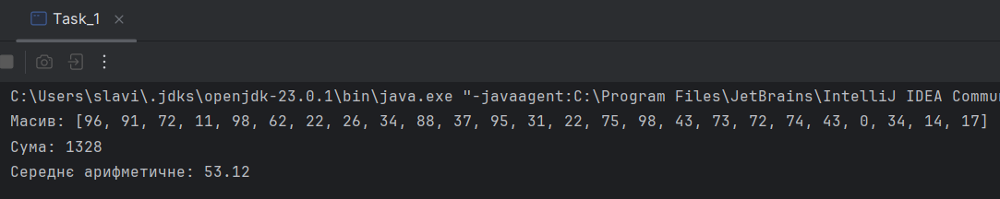
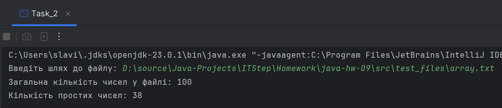
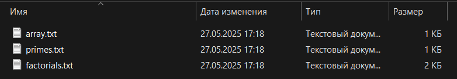
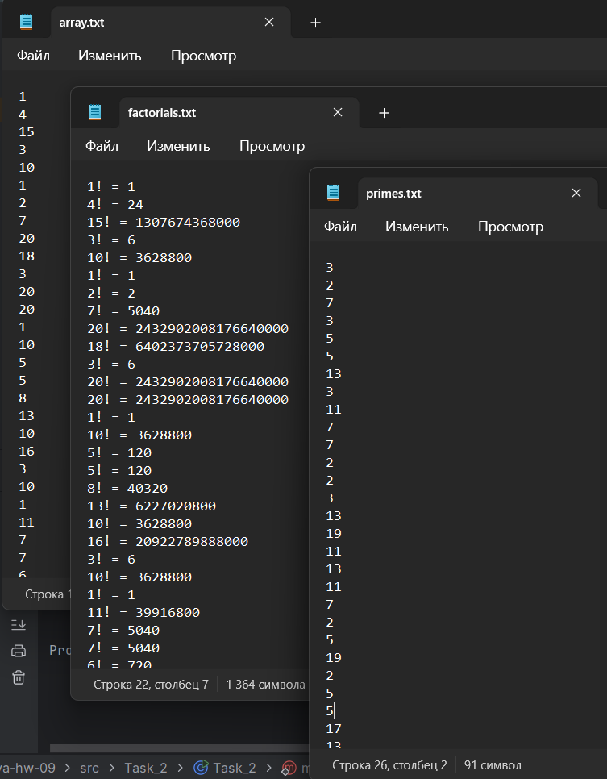
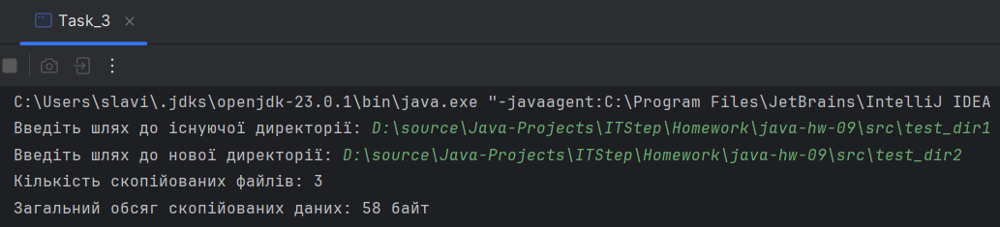
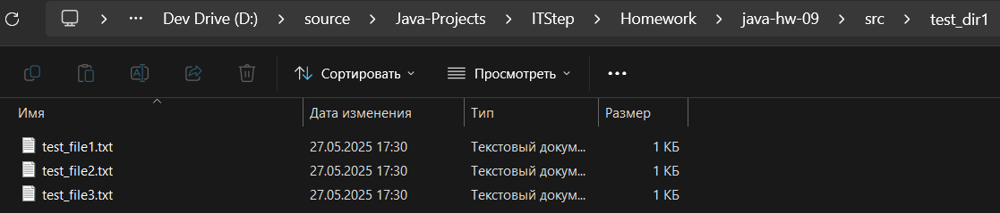
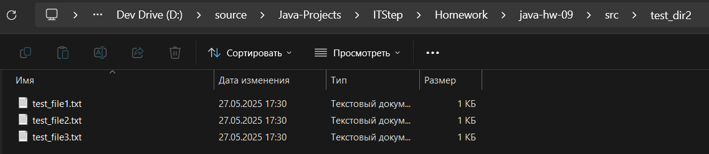
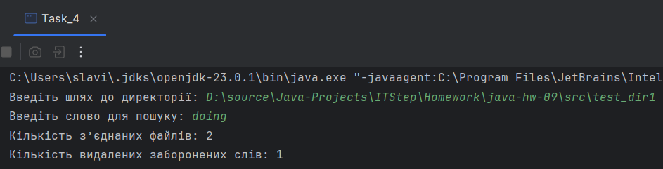
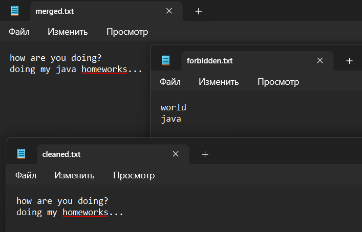

# Java | Homework 09

## Tasks

* [Task_1](./src/Task_1/) --> [Task_1.java](./src/Task_1/Task_1.java)
* [Task_2](./src/Task_2/) --> [Task_2.java](./src/Task_2/Task_2.java)
* [Task_3](./src/Task_3/) --> [Task_3.java](./src/Task_3/Task_3.java)
* [Task_4](./src/Task_4/) --> [Task_4.java](./src/Task_4/Task_4.java)

## Screenshots

### Task_1

### Task_2

### Task_3

### Task_4

