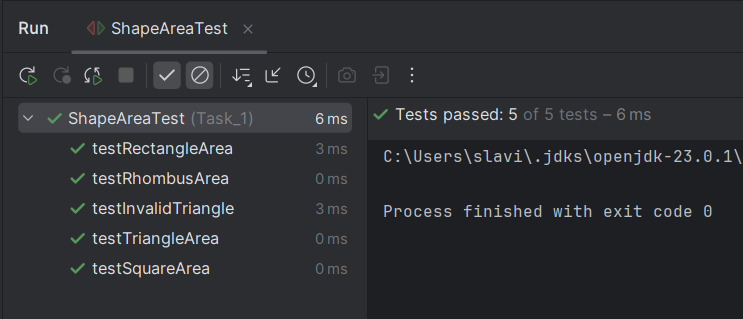
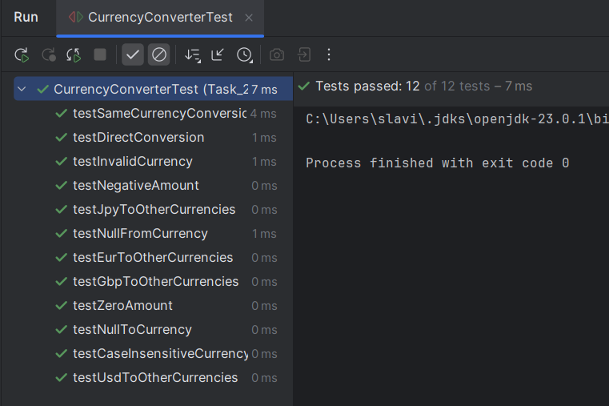
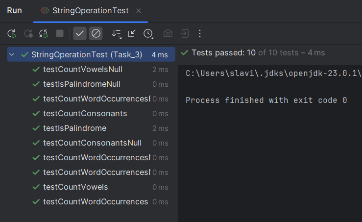
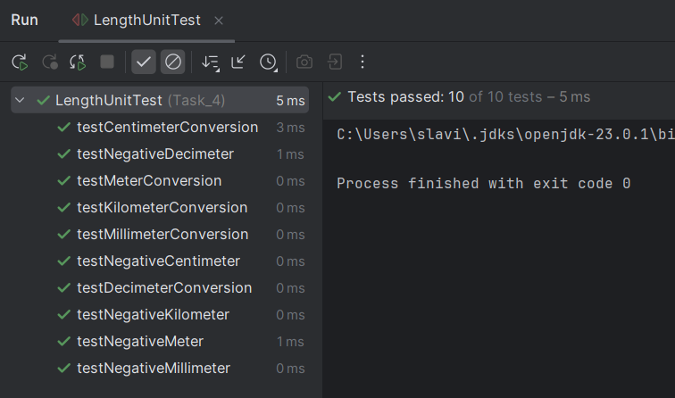
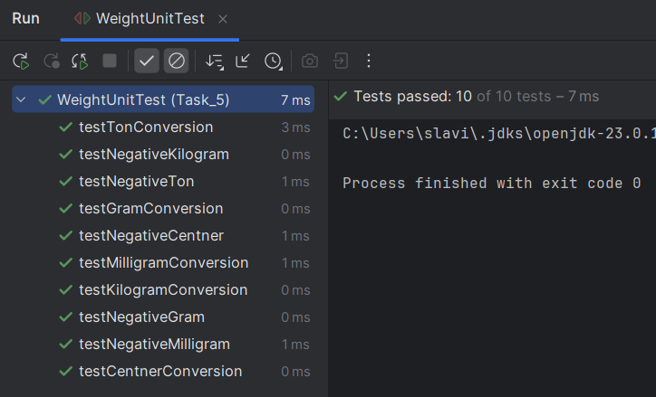

# Java | Homework 10

## Tasks

* [Task_1](./src/Task_1/)
    - [Rectangle.java](./src/Task_1/Rectangle.java)
    - [Rhombus.java](./src/Task_1/Rhombus.java)
    - [Shape.java](./src/Task_1/Shape.java)
    - [ShapeAreaTest.java](./src/Task_1/ShapeAreaTest.java)
    - [Square.java](./src/Task_1/Square.java)
    - [Triangle.java](./src/Task_1/Triangle.java)
* [Task_2](./src/Task_2/)
    - [Currency.java](./src/Task_2/Currency.java)
    - [CurrencyConverter.java](./src/Task_2/CurrencyConverter.java)
    - [CurrencyConverterTest.java](./src/Task_2/CurrencyConverterTest.java)
    - [CurrencyTest.java](./src/Task_2/CurrencyTest.java)
    - [Dollar.java](./src/Task_2/Dollar.java)
    - [Euro.java](./src/Task_2/Euro.java)
    - [Pound.java](./src/Task_2/Pound.java)
    - [Yen.java](./src/Task_2/Yen.java)
* [Task_3](./src/Task_3/)
    - [StringOperation.java](./src/Task_3/StringOperation.java)
    - [StringOperationTest.java](./src/Task_3/StringOperationTest.java)
    - [StringProcessor.java](./src/Task_3/StringProcessor.java)
* [Task_4](./src/Task_4/)
    - [Centimeter.java](./src/Task_4/Centimeter.java)
    - [Decimeter.java](./src/Task_4/Decimeter.java)
    - [Kilometer.java](./src/Task_4/Kilometer.java)
    - [LengthUnit.java](./src/Task_4/LengthUnit.java)
    - [LengthUnitTest.java](./src/Task_4/LengthUnitTest.java)
    - [Meter.java](./src/Task_4/Meter.java)
    - [Millimeter.java](./src/Task_4/Millimeter.java)
* [Task_5](./src/Task_5/)
    - [Centner.java](./src/Task_5/Centner.java)
    - [Gram.java](./src/Task_5/Gram.java)
    - [Kilogram.java](./src/Task_5/Kilogram.java)
    - [Milligram.java](./src/Task_5/Milligram.java)
    - [Ton.java](./src/Task_5/Ton.java)
    - [WeightUnit.java](./src/Task_5/WeightUnit.java)
    - [WeightUnitTest.java](./src/Task_5/WeightUnitTest.java)

## Screenshots

### Task_1

### Task_2

### Task_3

### Task_4

### Task_5

