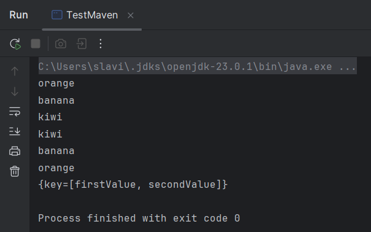
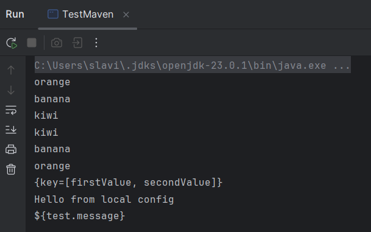
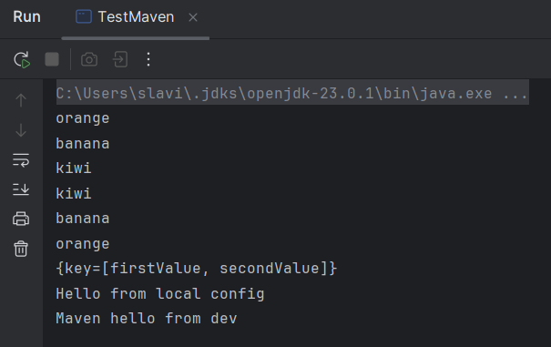
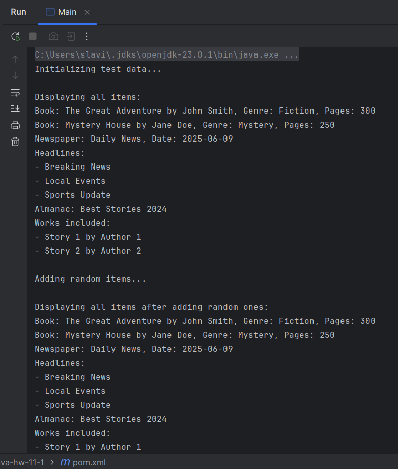
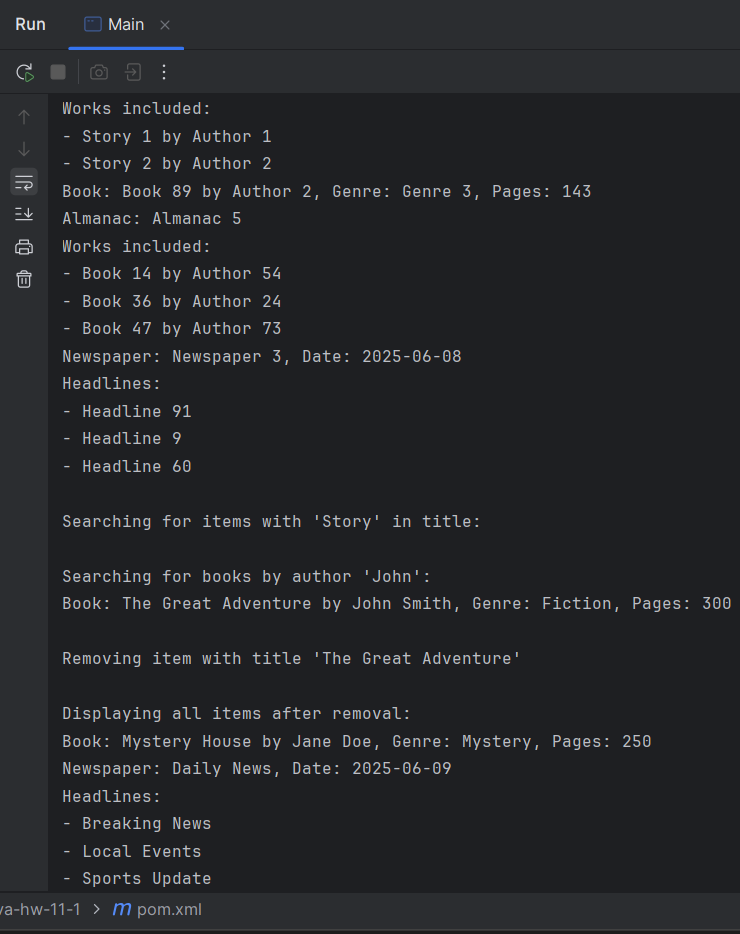
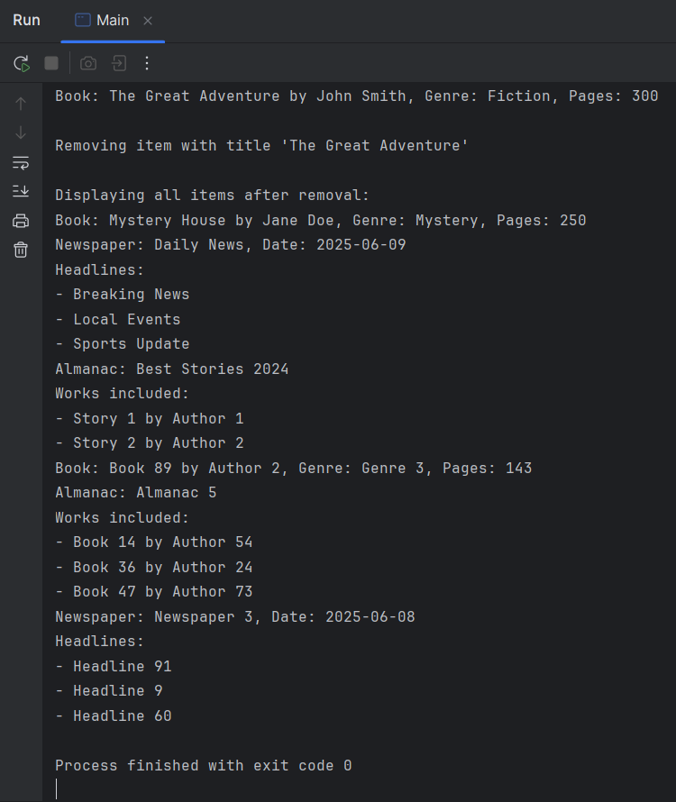

# Java | Homework 1

## Project Structure

### Source Code

* 📁 [main](./src/main/)
  * 📁 [java](./src/main/java/)
    * 📁 [com](./src/main/java/com/)
      * 📁 [itstep](./src/main/java/com/itstep/)
        * 📄 [TestMaven.java](./src/main/java/com/itstep/TestMaven.java)
        * 📁 [library](./src/main/java/com/itstep/library/)
          * 📄 [Almanac.java](./src/main/java/com/itstep/library/Almanac.java)
          * 📄 [Book.java](./src/main/java/com/itstep/library/Book.java)
          * 📄 [LibraryCatalog.java](./src/main/java/com/itstep/library/LibraryCatalog.java)
          * 📄 [LibraryItem.java](./src/main/java/com/itstep/library/LibraryItem.java)
          * 📄 [Main.java](./src/main/java/com/itstep/library/Main.java)
          * 📄 [Newspaper.java](./src/main/java/com/itstep/library/Newspaper.java)
  * 📁 [resources](./src/main/resources/)
    * 📄 [config.properties](./src/main/resources/config.properties)

### Maven Configuration

* 📄 [pom.xml](pom.xml)

## Screenshots

