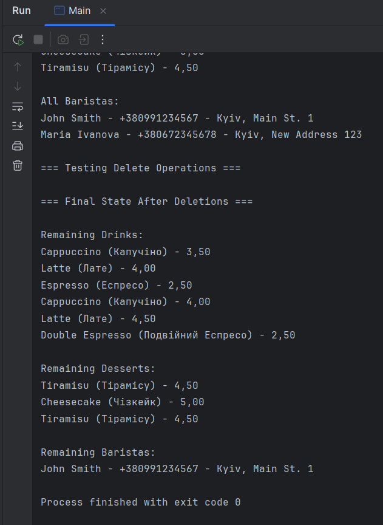

# Java | Homework 11

## Tasks

- [src/main/java/com/itstep/](./src/main/java/com/itstep/)
    - [model/](./src/main/java/com/itstep/model/)
        - [Customer.java](./src/main/java/com/itstep/model/Customer.java)
        - [CustomerOrderInfo.java](./src/main/java/com/itstep/model/CustomerOrderInfo.java)
        - [MenuItem.java](./src/main/java/com/itstep/model/MenuItem.java)
        - [Order.java](./src/main/java/com/itstep/model/Order.java)
        - [Staff.java](./src/main/java/com/itstep/model/Staff.java)
        - [WorkSchedule.java](./src/main/java/com/itstep/model/WorkSchedule.java)
    - [service/](./src/main/java/com/itstep/service/)
        - [CoffeeShopService.java](./src/main/java/com/itstep/service/CoffeeShopService.java)
    - [util/](./src/main/java/com/itstep/util/)
        - [DatabaseConnection.java](./src/main/java/com/itstep/util/DatabaseConnection.java)
    - [Main.java](./src/main/java/com/itstep/Main.java)
    - [QueryTest.java](./src/main/java/com/itstep/QueryTest.java)
- [src/main/resources/](./src/main/resources/)
    - [schema.sql](./src/main/resources/schema.sql)

## Screenshots

### coffe_shop db

### Task_1

### Task_2

### Task_3

