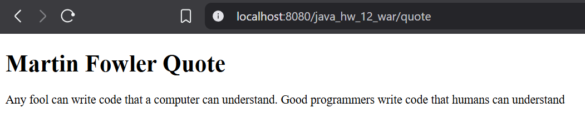
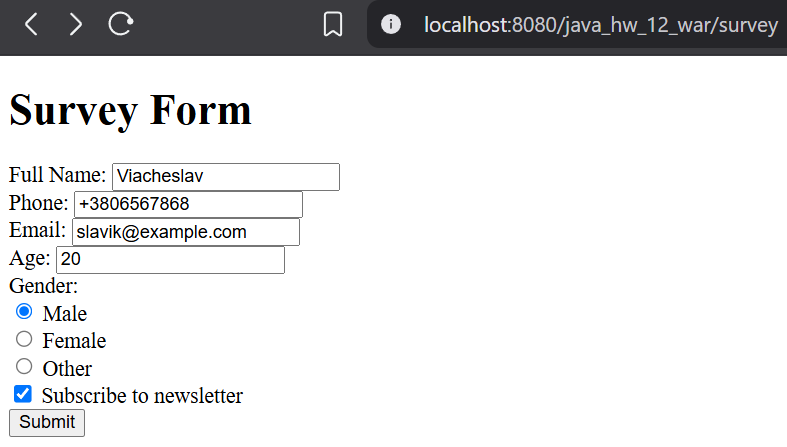
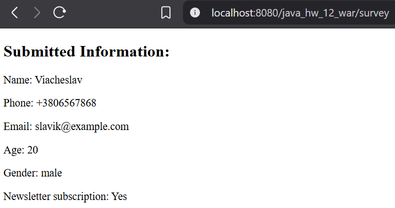
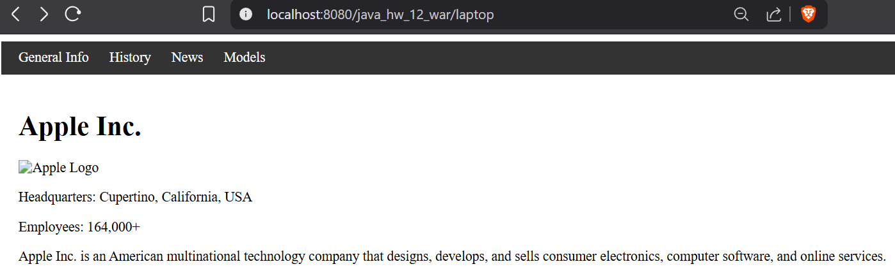
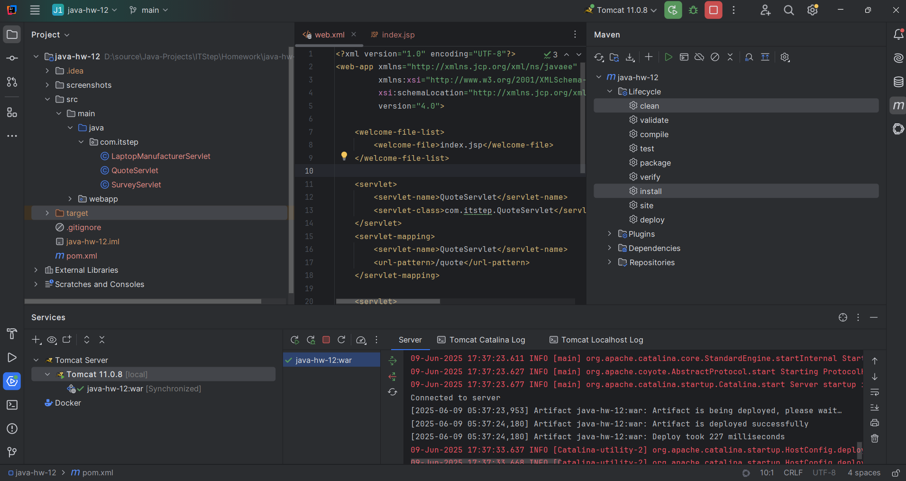

# Java | Homework 12

## Project Structure

### Source Code

* 📁 [main](./src/main/)
  * 📁 [java](./src/main/java/)
    * 📁 [com](./src/main/java/com/)
      * 📁 [itstep](./src/main/java/com/itstep/)
        * 📄 [LaptopManufacturerServlet.java](./src/main/java/com/itstep/LaptopManufacturerServlet.java)
        * 📄 [QuoteServlet.java](./src/main/java/com/itstep/QuoteServlet.java)
        * 📄 [SurveyServlet.java](./src/main/java/com/itstep/SurveyServlet.java)
  * 📁 [webapp](./src/main/webapp/)
    * 📁 [WEB-INF](./src/main/webapp/WEB-INF/)
      * 📄 [index.jsp](./src/main/webapp/WEB-INF/index.jsp)
      * 📄 [web.xml](./src/main/webapp/WEB-INF/web.xml)

### Maven Configuration

* 📄 [pom.xml](pom.xml)

## Screenshots

