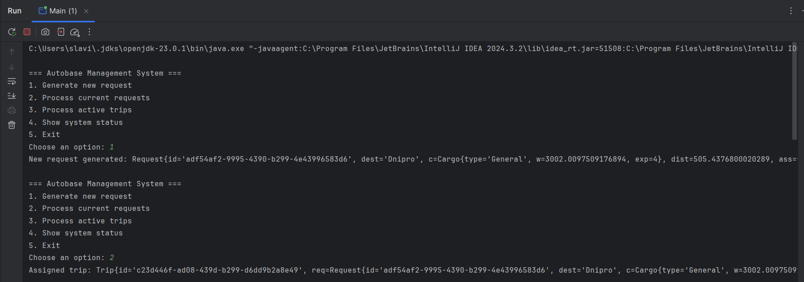
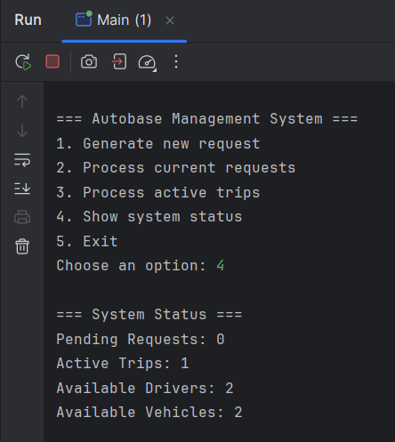

# Java | Homework 13

## Project Structure

### Source Code

* 📄 [Main.java](src\Main.java)
* 📁 [classes](src\classes/)
  * 📄 [Cargo.java](src\classes\Cargo.java)
  * 📄 [Dispatcher.java](src\classes\Dispatcher.java)
  * 📄 [Driver.java](src\classes\Driver.java)
  * 📄 [Request.java](src\classes\Request.java)
  * 📄 [Statistics.java](src\classes\Statistics.java)
  * 📄 [Trip.java](src\classes\Trip.java)
  * 📄 [Vehicle.java](src\classes\Vehicle.java)

## Screenshots

