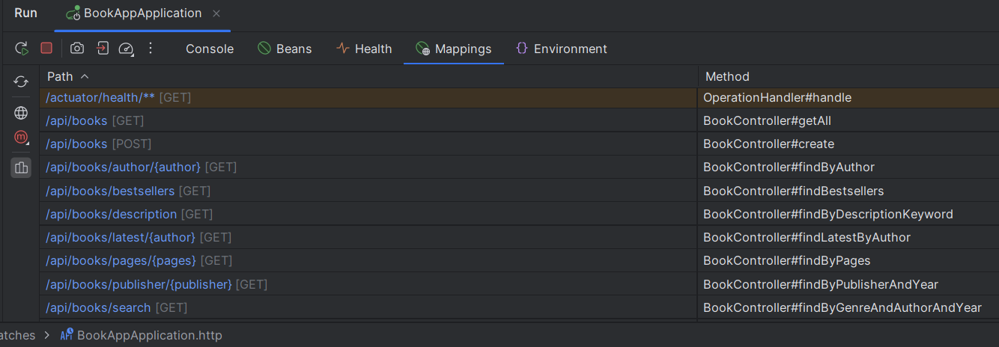
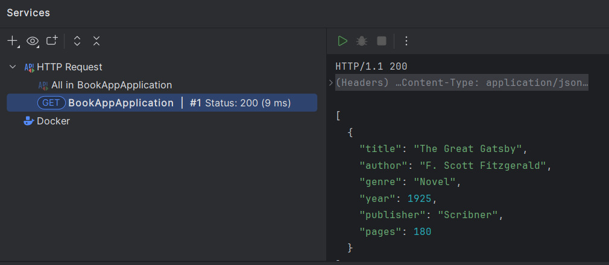
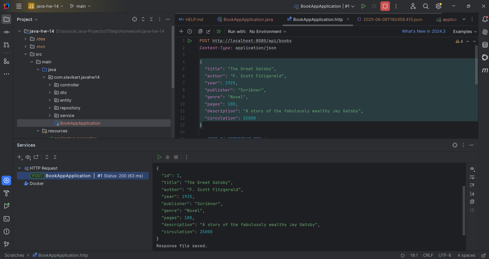

# Java | Homework 14

## Project Structure

### Source Code

* 📁 [main](./src/main/)
  * 📁 [java](./src/main/java/)
    * 📁 [com](./src/main/java/com/)
      * 📁 [slavikart](./src/main/java/com/slavikart/)
        * 📁 [javahw14](./src/main/java/com/slavikart/javahw14/)
          * 📄 [BookAppApplication.java](./src/main/java/com/slavikart/javahw14/BookAppApplication.java)
          * 📁 [controller](./src/main/java/com/slavikart/javahw14/controller/)
            * 📄 [BookController.java](./src/main/java/com/slavikart/javahw14/controller/BookController.java)
          * 📁 [dto](./src/main/java/com/slavikart/javahw14/dto/)
            * 📄 [BookDTO.java](./src/main/java/com/slavikart/javahw14/dto/BookDTO.java)
          * 📁 [entity](./src/main/java/com/slavikart/javahw14/entity/)
            * 📄 [Book.java](./src/main/java/com/slavikart/javahw14/entity/Book.java)
          * 📁 [repository](./src/main/java/com/slavikart/javahw14/repository/)
            * 📄 [BookRepository.java](./src/main/java/com/slavikart/javahw14/repository/BookRepository.java)
          * 📁 [service](./src/main/java/com/slavikart/javahw14/service/)
            * 📄 [BookService.java](./src/main/java/com/slavikart/javahw14/service/BookService.java)
  * 📁 [resources](./src/main/resources/)
    * 📄 [application.properties](./src/main/resources/application.properties)

### Maven Configuration

* 📄 [pom.xml](pom.xml)

## Screenshots

