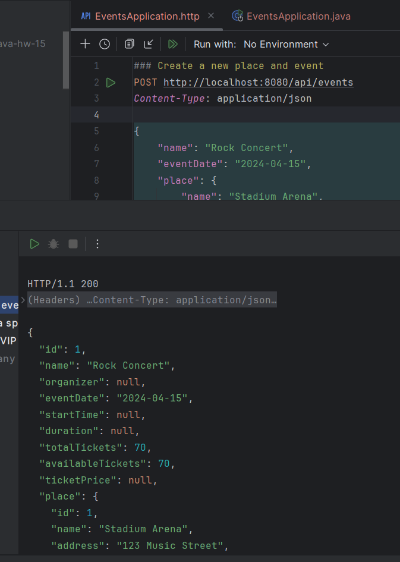
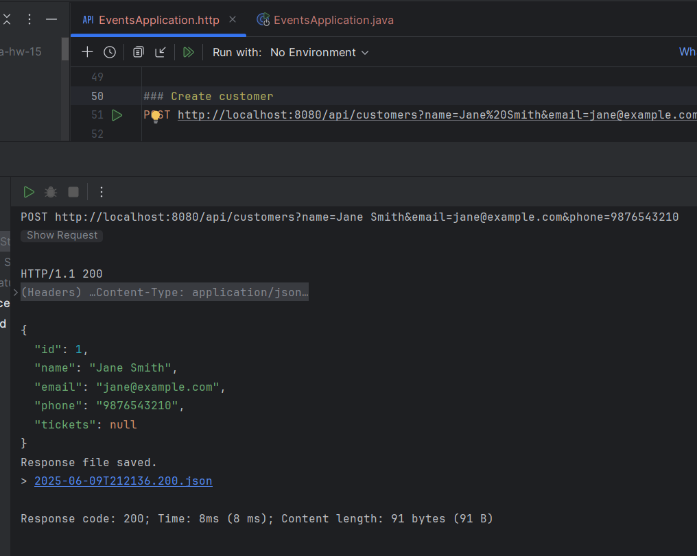
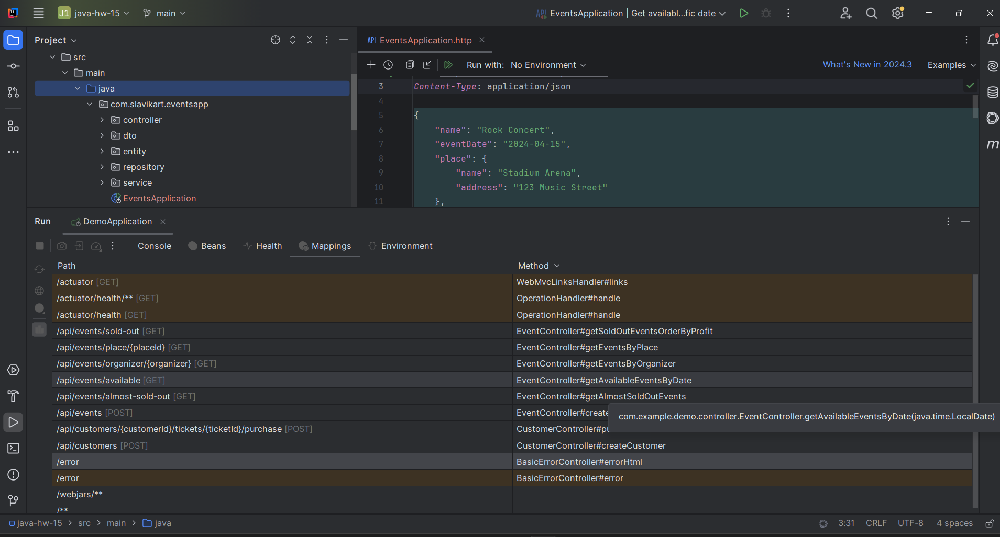

# Java | Homework 15

## Project Structure

### Source Code

* 📁 [main](./src/main/)
  * 📁 [java](./src/main/java/)
    * 📁 [com](./src/main/java/com/)
      * 📁 [slavikart](./src/main/java/com/slavikart/)
        * 📁 [eventsapp](./src/main/java/com/slavikart/eventsapp/)
          * 📄 [EventsApplication.java](./src/main/java/com/slavikart/eventsapp/EventsApplication.java)
          * 📁 [controller](./src/main/java/com/slavikart/eventsapp/controller/)
            * 📄 [CustomerController.java](./src/main/java/com/slavikart/eventsapp/controller/CustomerController.java)
            * 📄 [EventController.java](./src/main/java/com/slavikart/eventsapp/controller/EventController.java)
          * 📁 [dto](./src/main/java/com/slavikart/eventsapp/dto/)
            * 📄 [EventCreationDTO.java](./src/main/java/com/slavikart/eventsapp/dto/EventCreationDTO.java)
            * 📄 [PlaceDTO.java](./src/main/java/com/slavikart/eventsapp/dto/PlaceDTO.java)
            * 📄 [TicketPackDTO.java](./src/main/java/com/slavikart/eventsapp/dto/TicketPackDTO.java)
          * 📁 [entity](./src/main/java/com/slavikart/eventsapp/entity/)
            * 📄 [Customer.java](./src/main/java/com/slavikart/eventsapp/entity/Customer.java)
            * 📄 [Event.java](./src/main/java/com/slavikart/eventsapp/entity/Event.java)
            * 📄 [Place.java](./src/main/java/com/slavikart/eventsapp/entity/Place.java)
            * 📄 [Ticket.java](./src/main/java/com/slavikart/eventsapp/entity/Ticket.java)
            * 📄 [TicketStatus.java](./src/main/java/com/slavikart/eventsapp/entity/TicketStatus.java)
          * 📁 [repository](./src/main/java/com/slavikart/eventsapp/repository/)
            * 📄 [CustomerRepository.java](./src/main/java/com/slavikart/eventsapp/repository/CustomerRepository.java)
            * 📄 [EventRepository.java](./src/main/java/com/slavikart/eventsapp/repository/EventRepository.java)
            * 📄 [PlaceRepository.java](./src/main/java/com/slavikart/eventsapp/repository/PlaceRepository.java)
            * 📄 [TicketRepository.java](./src/main/java/com/slavikart/eventsapp/repository/TicketRepository.java)
          * 📁 [service](./src/main/java/com/slavikart/eventsapp/service/)
            * 📄 [CustomerService.java](./src/main/java/com/slavikart/eventsapp/service/CustomerService.java)
            * 📄 [EventService.java](./src/main/java/com/slavikart/eventsapp/service/EventService.java)
  * 📁 [resources](./src/main/resources/)
    * 📄 [EventsApplication.http](./src/main/resources/EventsApplication.http)
    * 📄 [application.properties](./src/main/resources/application.properties)

### Maven Configuration

* 📄 [pom.xml](pom.xml)

## Screenshots

