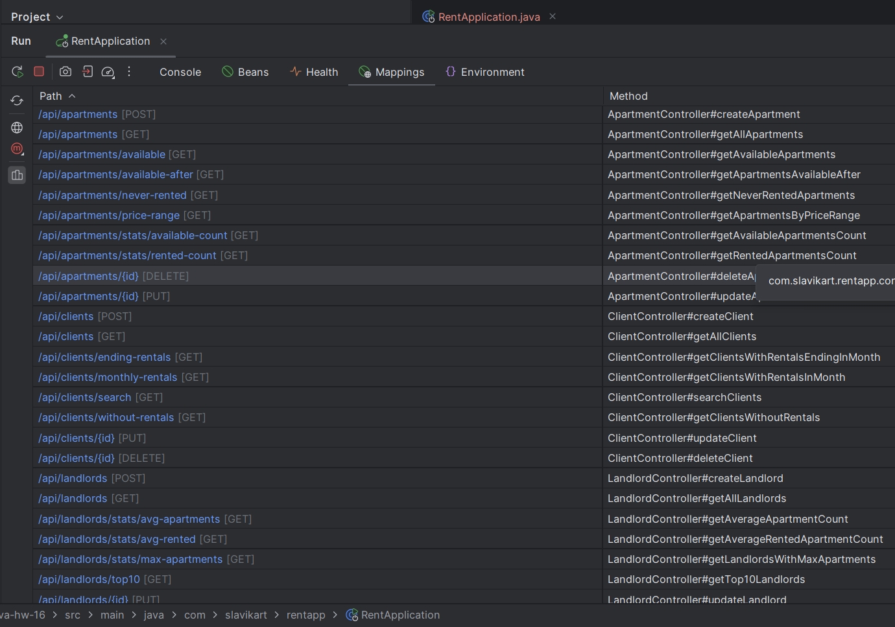
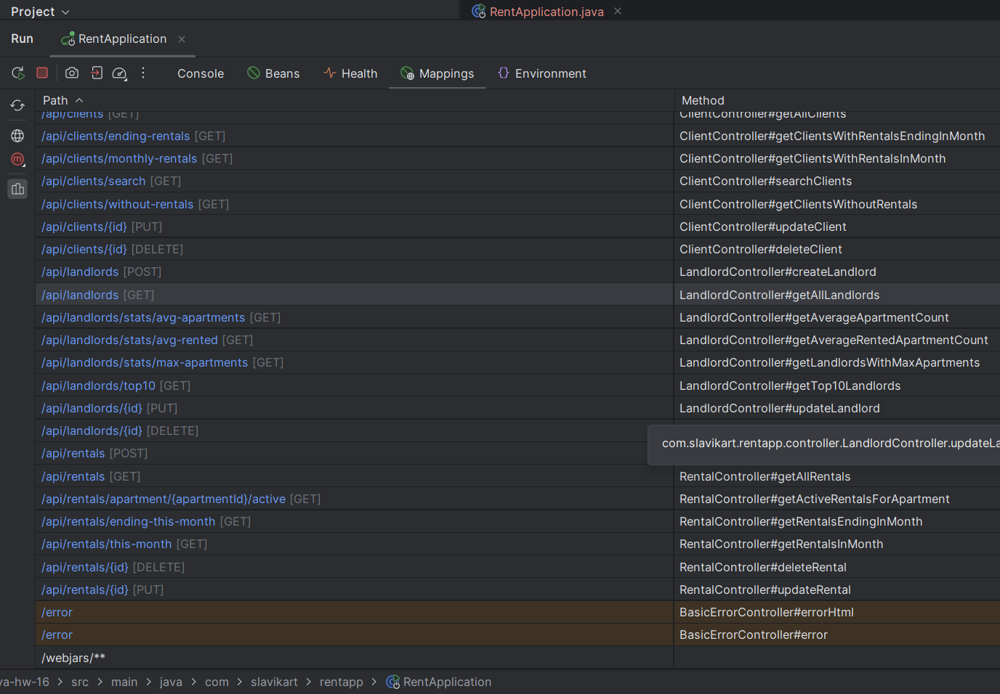
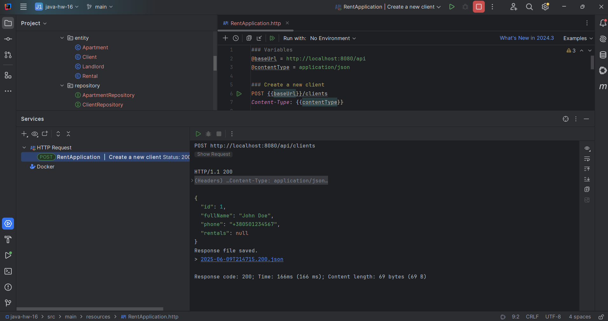
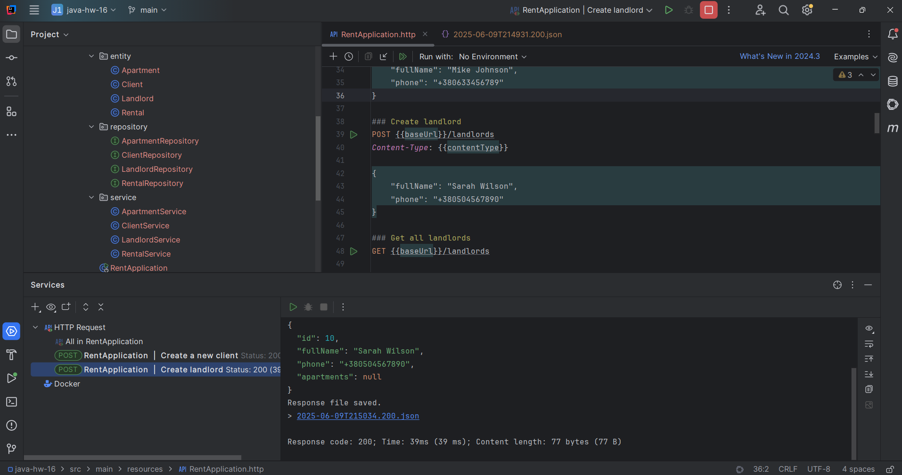
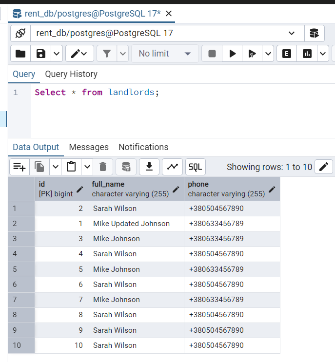

# Java | Homework 16

## Project Structure

### Source Code

* 📁 [main](./src/main/)
  * 📁 [java](./src/main/java/)
    * 📁 [com](./src/main/java/com/)
      * 📁 [slavikart](./src/main/java/com/slavikart/)
        * 📁 [rentapp](./src/main/java/com/slavikart/rentapp/)
          * 📄 [RentApplication.java](./src/main/java/com/slavikart/rentapp/RentApplication.java)
          * 📁 [controller](./src/main/java/com/slavikart/rentapp/controller/)
            * 📄 [ApartmentController.java](./src/main/java/com/slavikart/rentapp/controller/ApartmentController.java)
            * 📄 [ClientController.java](./src/main/java/com/slavikart/rentapp/controller/ClientController.java)
            * 📄 [LandlordController.java](./src/main/java/com/slavikart/rentapp/controller/LandlordController.java)
            * 📄 [RentalController.java](./src/main/java/com/slavikart/rentapp/controller/RentalController.java)
          * 📁 [entity](./src/main/java/com/slavikart/rentapp/entity/)
            * 📄 [Apartment.java](./src/main/java/com/slavikart/rentapp/entity/Apartment.java)
            * 📄 [Client.java](./src/main/java/com/slavikart/rentapp/entity/Client.java)
            * 📄 [Landlord.java](./src/main/java/com/slavikart/rentapp/entity/Landlord.java)
            * 📄 [Rental.java](./src/main/java/com/slavikart/rentapp/entity/Rental.java)
          * 📁 [repository](./src/main/java/com/slavikart/rentapp/repository/)
            * 📄 [ApartmentRepository.java](./src/main/java/com/slavikart/rentapp/repository/ApartmentRepository.java)
            * 📄 [ClientRepository.java](./src/main/java/com/slavikart/rentapp/repository/ClientRepository.java)
            * 📄 [LandlordRepository.java](./src/main/java/com/slavikart/rentapp/repository/LandlordRepository.java)
            * 📄 [RentalRepository.java](./src/main/java/com/slavikart/rentapp/repository/RentalRepository.java)
          * 📁 [service](./src/main/java/com/slavikart/rentapp/service/)
            * 📄 [ApartmentService.java](./src/main/java/com/slavikart/rentapp/service/ApartmentService.java)
            * 📄 [ClientService.java](./src/main/java/com/slavikart/rentapp/service/ClientService.java)
            * 📄 [LandlordService.java](./src/main/java/com/slavikart/rentapp/service/LandlordService.java)
            * 📄 [RentalService.java](./src/main/java/com/slavikart/rentapp/service/RentalService.java)
  * 📁 [resources](./src/main/resources/)
    * 📄 [RentApplication.http](./src/main/resources/RentApplication.http)
    * 📄 [application.properties](./src/main/resources/application.properties)

### Maven Configuration

* 📄 [pom.xml](pom.xml)

## Screenshots

